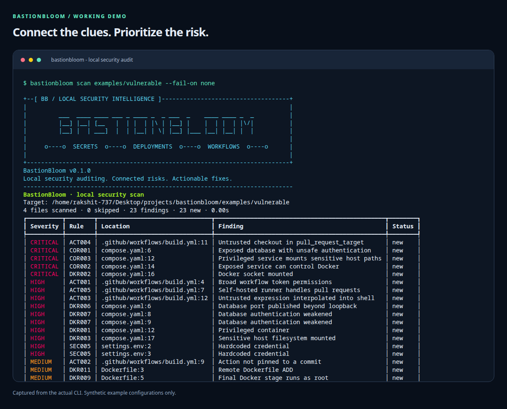
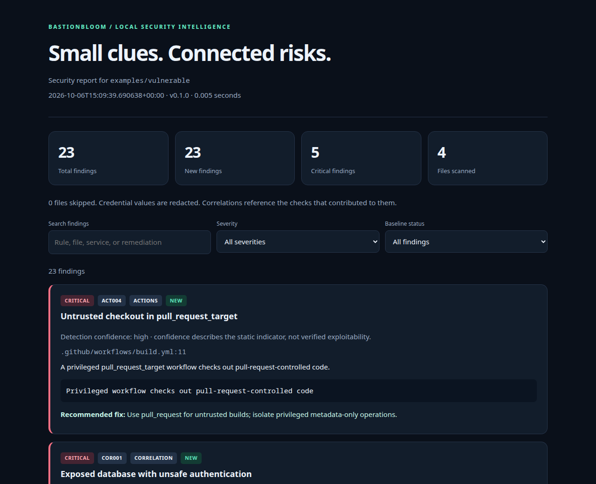
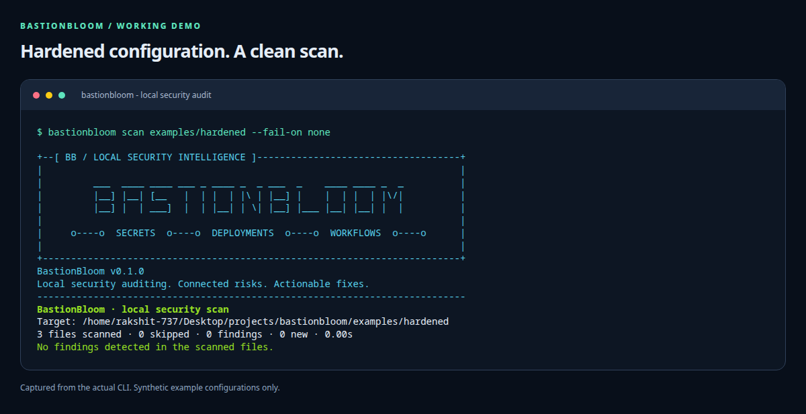

# BastionBloom

**Small clues. Connected risks.**

[Documentation](https://rakshit-737.github.io/bastionbloom/) ·
[Interactive demo](https://rakshit-737.github.io/bastionbloom/demo-report/) ·
[Rule catalog](https://rakshit-737.github.io/bastionbloom/rules/)

A useful, local-first cybersecurity project for developers and small teams:
find accidentally committed credentials, risky Docker deployments, and unsafe
GitHub Actions workflows before they become incidents.

BastionBloom's distinguishing feature is **risk correlation**. It connects
related problems within the same Compose file and service, with links back to
the underlying findings and a prioritized remediation.

| Connected clues | Escalated finding |
| --- | --- |
| Published database + weak/empty/trust authentication | Exposed database with unsafe authentication |
| Published service + Docker socket mount | Exposed service can control Docker |
| Privileged container + sensitive host mount | Privileged service can access host files |

The scanner runs entirely on your machine. It does not upload source code,
execute project code, launch containers, or contact the services being scanned.
Credential values are redacted from terminal output, JSON, HTML, and baselines.

## Features

- **24 security rules:** private keys, GitHub/Slack token formats, AWS access key
  identifiers, credential-like literals, Docker settings, workflow risks, and
  three connected-risk checks.
- **Actionable findings:** severity, detection confidence, source location,
  redacted evidence, explanation, and recommended fix.
- **Offline HTML dashboard:** search, severity/status filters, connected-finding
  links, responsive layout, and print styling; no external assets.
- **Automation-ready JSON:** versioned schema and reliable CI exit codes.
- **SARIF for code scanning:** upload stable, redacted findings to GitHub Code
  Scanning or another SARIF-compatible CI platform.
- **Portable baselines:** keep existing findings visible while failing CI only
  for new or severity-escalated findings; track resolved findings.
- **Bounded scanning:** nested `.gitignore` support, custom exclusions, size
  limits, symlink avoidance, and bounded safe YAML parsing.
- **Before-and-after examples** and security-focused regression tests.
- **Professional terminal identity:** three ASCII-only, 76-column banner styles
  with an optional compact startup display for narrow terminals.

## Demo screenshots

These screenshots are captured from the working CLI and its generated HTML
report using the repository's synthetic example configurations.

### Vulnerable configuration: 23 findings and three connected-risk checks



### Interactive HTML dashboard

Search findings, filter by severity, inspect redacted evidence, and follow
connected risks to their source checks. **[Open the live demo report](https://rakshit-737.github.io/bastionbloom/demo-report/).**

[](https://rakshit-737.github.io/bastionbloom/demo-report/)

### Hardened configuration: zero findings



## Install

Requires **Python 3.11+**. From the repository directory:

```bash
python3 -m venv .venv
source .venv/bin/activate
python -m pip install -e '.[dev]'
bastionbloom --version
```

For a runtime-only installation, use `python -m pip install .`. The project uses
Typer, Rich, PyYAML, Jinja2, and pathspec. `python -m bastionbloom` also works.

## Try the project

```bash
# See intentionally vulnerable examples; exit code 1 is expected.
bastionbloom scan examples/vulnerable --details

# Generate a local dashboard without failing on the demonstration findings.
bastionbloom scan examples/vulnerable --format html --output security-report.html --fail-on none

# The hardened examples should produce zero findings.
bastionbloom scan examples/hardened --fail-on low

# Inspect all rules and their remediation guidance.
bastionbloom rules --details
```

Open `security-report.html` in your browser. The examples are static scanning
fixtures: the vulnerable credential strings are synthetic and the nested
example workflows are not active workflows in this repository.

## Scan your own project

```bash
bastionbloom scan /path/to/project --details
bastionbloom scan /path/to/project --format json --output security-report.json
bastionbloom scan /path/to/project --format sarif --output bastionbloom.sarif --fail-on none
bastionbloom scan /path/to/project --fail-on medium
```

By default, root and nested `.gitignore` files are respected. **To inspect
gitignored files such as `.env`, use `--no-gitignore`:**

```bash
bastionbloom scan /path/to/project --no-gitignore --details
```

Dependency, build, and VCS directories such as `.venv`, `node_modules`, `dist`,
and `.git` are always pruned. Regular UTF-8 files up to 1 MiB are scanned;
binary, oversized, non-UTF-8, symlink, and special files are skipped.
`--max-file-kb 2048` raises the per-file limit to 2 MiB.

Structured checks recognize Compose filenames such as `compose.yaml` and
`docker-compose.yml` (including dot-separated override variants),
`Dockerfile`/`Dockerfile.*`, and YAML files beneath `.github/workflows/`.
Secret patterns are checked in every included text file. Findings with the same
rule, path, and logical identity are deduplicated.

### Ignore rules and false positives

Create `.bastionbloomignore` at the scan root using gitignore syntax:

```gitignore
generated/
*.min.js
!important.min.js
```

Custom ignore rules override gitignore decisions; repeatable `--exclude` globs
have the highest precedence. Reinclusion inside an excluded directory requires
reinclusion of the parent directory as well, following gitignore semantics.

```bash
bastionbloom scan . --exclude 'vendor/' --exclude '*.map'
bastionbloom scan . --exclude-rule SEC005
```

Disabling a source rule also prevents correlations that depend on that rule.
This repository's `.bastionbloomignore` excludes intentional test/vulnerable
fixtures from root self-scans. Scanning `examples/vulnerable` directly includes
those fixtures.

## Startup banners

The premium design is shown by default for terminal output. Choose a style,
hide the banner, or export exact raw ASCII:

```bash
bastionbloom --banner-style minimal scan .
bastionbloom --banner-style aggressive scan .
bastionbloom --banner-style premium scan .
bastionbloom --no-banner scan .
bastionbloom banner --style premium --startup
```

Global banner options go before the command. JSON/HTML stdout remains clean.
See [docs/banners.md](docs/banners.md) for all three copy-ready designs and a
startup example with the project name, version, tagline, and separator.

## Baseline workflow

```bash
# Record the current findings after reviewing them.
bastionbloom baseline /path/to/project --output bastionbloom-baseline.json

# Existing findings remain in the report; only new/escalated risks fail the threshold.
bastionbloom scan /path/to/project --baseline bastionbloom-baseline.json --fail-on high
```

Baselines store fingerprints and metadata, without source snippets or credential
values. They work across checkouts because findings use relative paths. A moved
or rotated credential gets the appropriate identity: moving its line does not
reopen it, but changing its value does. Some checks use a line or step position
when no stable logical identity is available.

Keep scan exclusions and size limits consistent when comparing baselines.
An incomplete scan cannot create a baseline and does not claim resolved findings.
Report/baseline output files are automatically excluded from their own scan.

## CI exit codes

| Code | Meaning |
| --- | --- |
| `0` | No **new** findings meet the selected severity threshold |
| `1` | New findings meet or exceed the threshold; default is `high` |
| `2` | Invalid inputs, an output error, or incomplete scan coverage |

`--fail-on none` disables finding-based failure, while scan errors still return
`2`. JSON or HTML without `--output` is emitted directly to stdout. With
`--output`, a summary is shown in the terminal and the report is saved atomically.

## How it works

```text
Local files → ignore/size checks → secret + configuration detectors
            → service-scoped correlation → baseline comparison → redacted reports
```

See [docs/rules.md](docs/rules.md) for the complete rule catalog and interpretation.
Detection confidence describes the strength of the static indicator, not
verified exploitability. Token validity, runtime environment substitution,
firewall reachability, Compose overrides, and base-image default users are not
resolved. A version tag is accepted for images; only actions require immutable
commit/digest pins. This is a focused static scanner, without CVE dependency
analysis or full-language data-flow analysis.

## Development and verification

```bash
ruff check .
pytest
bastionbloom scan . --fail-on low
python -m pip wheel --no-deps --wheel-dir dist .
```

GitHub Actions runs linting, security regressions, a repository self-scan, and
package builds on Python 3.11, 3.12, 3.13, and 3.14. CI actions are commit-pinned
and the workflow token has read-only repository permissions.

The [documentation site](https://rakshit-737.github.io/bastionbloom/) is built
with MkDocs Material and automatically deployed through GitHub Pages. See the
[development guide](https://rakshit-737.github.io/bastionbloom/development/)
for local previews and reproducible screenshot capture.

```text
src/bastionbloom/   CLI, scanner, detectors, correlation, baselines, and reports
examples/          Vulnerable and hardened sample configurations
tests/             Credential privacy, parsing, scan-boundary, and CI behavior tests
docs/              Documentation site, rule catalog, banners, and demo screenshots
scripts/           Reproducible demo capture and documentation build hooks
```

## License

MIT. Created by [rakshit-737](https://github.com/rakshit-737).
